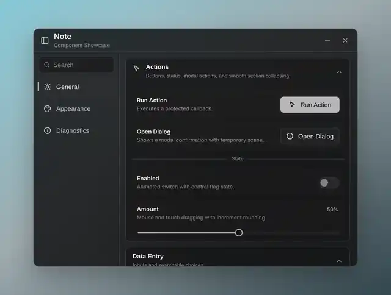
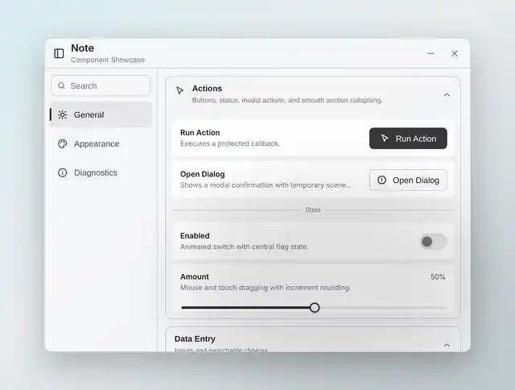

# Note HTML Preview

`index.html` is a browser implementation of `examples/showcase.lua`. The original Luau showcase remains unchanged.

It includes the General, Appearance, and Diagnostics tabs; the showcase controls; dark and light themes; section collapsing; validation; password reveal; dropdowns; notifications; and the dialog interaction.

## Dark

## Light

Open `index.html` directly in a modern browser. Use `?theme=dark` or `?theme=light` to choose the initial theme.
